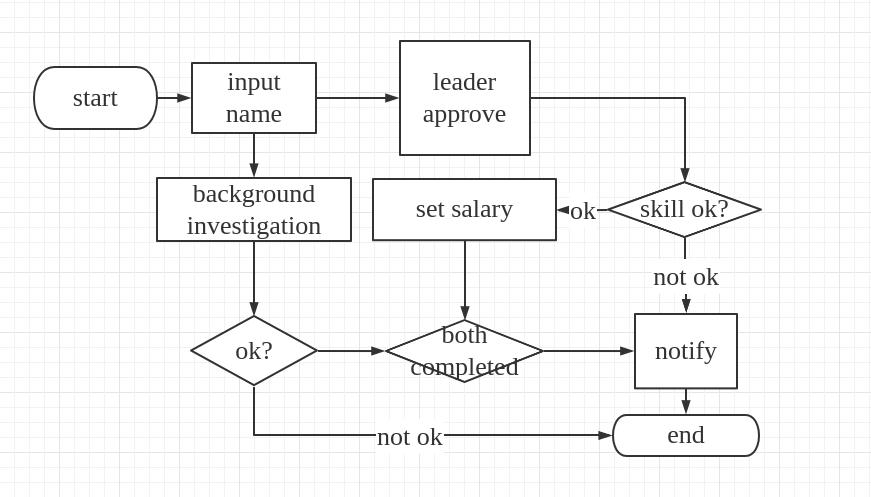

# A Process WorkFlow Engine
A pseudo-working workflow engine capable of building a workflow of tasks and conditional nodes that define the branching of the workflow


# Example

## hire flow

```
class HireFlow(flows.Flow):

    process_class = models.HireProcess
    task_class = models.HireTask

    start = nodes.Start(
        viewclass=rest_extensions.AutoCreateAPIView,
        serializer_class=serializers.AddCandidateSerializer,
    ).Permission(
        group=Group.objects.get_or_create(name="hr")[0]
    ).Next(
        this.split_to_3rd_and_direct_leader
    )

    split_to_3rd_and_direct_leader = nodes.Split(
    ).Always(
        this.approve
    ).Always(
        this.background_research
    )

    background_research = nodes.View(
        viewclass=rest_extensions.AutoUpdateAPIView,
        fields=["background_ok"],
    ).Next(
        this.check_background
    )

    check_background = nodes.If(
        cond=lambda activation: activation.process.background_ok
    ).Then(
        this.join_on_both_approve
    ).Else(
        this.end
            )

    join_on_both_approve = nodes.Join().Next(
        this.notify
    )

    notify = nodes.View(
        viewclass=rest_extensions.AutoUpdateAPIView,
        fields=["notified"],
    ).Next(
        this.end
    )

    approve = nodes.View(
        viewclass=rest_extensions.AutoUpdateAPIView,
        serializer_class = serializers.ApproveSerializer,
        # fields=["approved"],
    ).Permission(
        group=Group.objects.get_or_create(name="leader")[0]
    ).Next(
        this.check_if_approve
    )

    check_if_approve = nodes.If(
        cond=lambda activation: activation.process.approved
    ).Then(
        this.set_salary
    ).Else(
        this.notify
    )

    set_salary = nodes.View(
        viewclass=rest_extensions.AutoUpdateAPIView,
        fields=["salary"],
    ).Permission(
        group=Group.objects.get_or_create(name="hr")[0]
    ).Next(
        this.join_on_both_approve
    )

    end = nodes.End()
```
 


# Quick Start
use the `hire` as an example


### Requirements(Main)
1. Python 3.8+ (Recommended 3.8.10 or later)
2. [Poetry](https://github.com/python-poetry/poetry#installation)
3. Django = "^4.1"
4. Djangorestframework = "^3.13.1"
5. Django-status-signal = "^0.0.2"

### Other dependencies
1. black = "^22.6.0"
2. isort = "^5.10.1"
3. flake8 = "^5.0.4"
4. virtualenv = "^20.16.3"
5. django-environ = "^0.9.0"


## Instructions

1. Clone repository
    ```
    git clone git@github.com:Festorah/Workflow-Engine.git
    ```
2. Create a virtual environment of name `.venv` in project root directory
    ```bash
    $ virtualenv --python=python3.8 .venv
    ```
3. Activate virtual environment
    ```bash
   $ source .venv/bin/activate
   ```
4. Install project dependencies. 
    ```bash
    $ poetry install
    ```
    Or

    ```
    cd adilo/
    sudo pip3 install -r requirements.txt
    ```

5. Apply database migrations
    ```bash
    Makesure you remember to set SECRET_KEY 
    $ python manage.py migrate
    ```
6. Run application
    ```
    $ python manage.py runserver
    # visit http://localhost:8000/hire/ to get the api
    ```  
6. To deactivate virtual environment
    ```bash
    $ deactivate
    ```


# term

## workflow
A flow contains many flow\_tasks/nodes  


## Edge
* src: source Node instance
* dst: target Node instance

## activations
* Attribute
    * `flow_class`
    * `flow_task`: Node Instance defined in the `flows.py`
    * `task`: Current Task

## Nodes
* Function
    * `_incoming`: Edge Instance list
    * `_outgoing`: Edge Instance list
